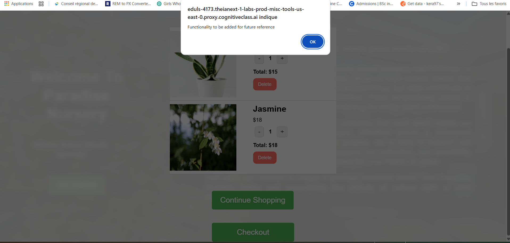
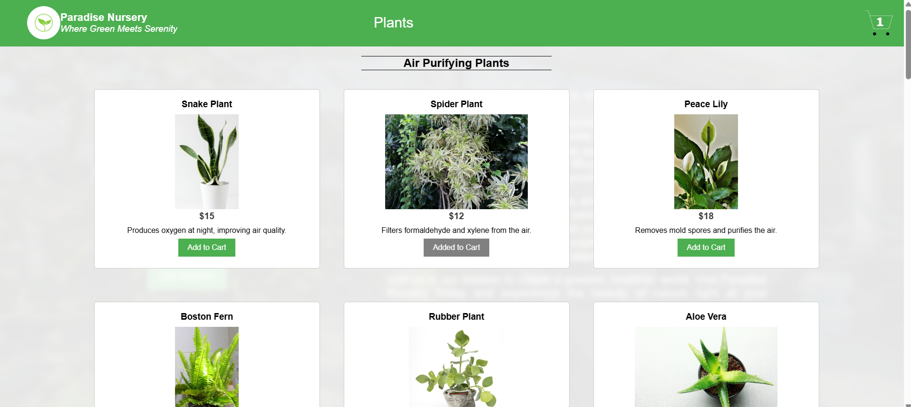
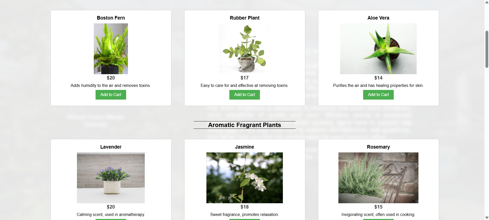
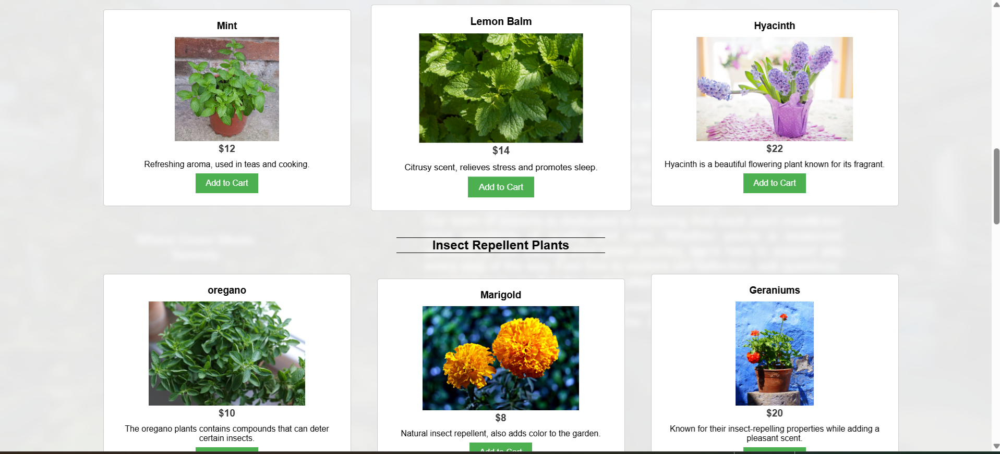
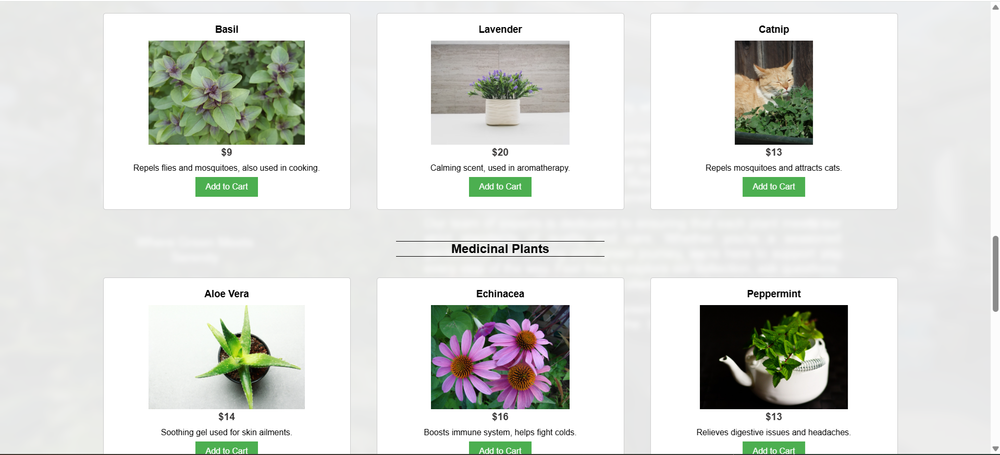

# 🌱 E-plantShopping

Application React (Vite) permettant d’explorer et acheter des plantes en ligne.  
Projet rapide, moderne et optimisé grâce à Vite.
Projet final module Ract - IBM Dev Full Stack


---

## 🚀 Installation

```bash
git clone <url-du-projet>
cd e-plantShopping
npm install

Lancement du projet :
npm run dev

Dispobible sur :
http://localhost:5173


Build pour la production :
npm run build


Prévisualisation du build :
npm run preview

🛠️ Tech stack

React 18  
Vite  
JavaScript / JSX  
CSS / Tailwind / autre (à préciser)

Contributions
Les contributions, issues et suggestions sont les bienvenues !


----

## 🌿 Aperçu du projet

### 🏠 Page d'accueil


### 🛒 Checkout / Panier


### 🛍️ Liste des produits






### 💵 Total du panier
![Total](./images/totalamount.png


